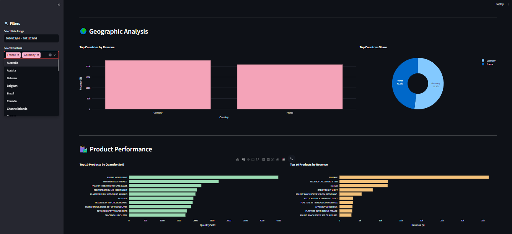

# Retail Analytics Dashboard

Interactive Business Intelligence dashboard for analyzing e-commerce sales data.  
Built with **Python, Streamlit, Pandas, and Plotly**.

## Live Demo
[View Live Dashboard](https://retail-analytics-dashboard-oum.streamlit.app)

## Preview


## What it shows
- Revenue, orders, customers, average order value
- Monthly sales trends
- Revenue by country
- Top products by quantity and revenue
- Hourly purchase patterns

## Dataset
UCI Online Retail Dataset (2010–2011)  
~500,000 transactions from a UK-based online retailer.

> Dataset not included. Place the CSV file in the data/ folder.

## Run locally
```bash
git clone https://github.com/Ou1ma/retail-analytics-dashboard.git
cd retail-analytics-dashboard
pip install -r requirements.txt
streamlit run app.py
